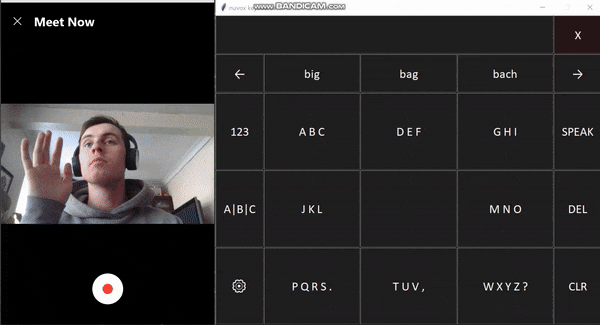

# nuvox

<p align="center">
  
</p>


### What is nuvox?
nuvox is an intelligent, on-screen keyboard that can be controlled with your eyes using commercial eye-tracking hardware.

### Who is it for?
nuvox is primarily designed for people with Motor Neuron Disease (MND) and other health conditions which prevent them from being able to speak or type. 

### Why am I building it?
Whilst there are some excellent eye-tracking keyboards already out there, the majority are outrageously expensive for what they are. 
[OptiKey](https://github.com/OptiKey/OptiKey) is a free, open-sourced alternative that I stumbled across a while ago and found really inspiring. My dad works at a school where several pupils communicate with these systems and after discussing it with him and trying them out for myself I identified several ways in which things could be improved. 

### How is nuvox different?

- nuvox uses a classic 9-key layout instead of the typical QWERTY keyboard. Bigger keys enable you to quickly dart your eyes from key to key with less mistakes. This allows for a faster, smoother and less frustrating user experience.

- nuvox leverages an insanely powerful machine learning algorithm called [GPT-2](https://openai.com/blog/better-language-models/) to understand what you're trying to type. This means less time making corrections - more time saying what you want to say.

- nuvox embraces a minimalist design. Typing with your eyes can be tricky at the best of times - do you really need all those advanced buttons and settings taking up space? Keep it simple.

### How does writing work with nuvox?

To maximise your typing speed nuvox uses a system similar to the [__swype__](https://en.wikipedia.org/wiki/Swype) keyboards available on many smart phones. To type a word, begin by focusing on the key that contains the first letter of that word fora full second. As you focus on the key it glows progressively darker red before flashing green to indicate that the swype has started. You should then dart your eyes to the other keys required to make up your word in order before dwelling on the final key for a full second to complete the swype. Note you do **not** need to dwell on each intermediate keys for a full second. 

After the swype is complete - the top predicted word will briefly flash red on the final key - this is so that you can immediately check it without repeatedly glancing up at the text box. If the predicted word is wrong you can replace it by gazing at one of the suggestions below the text box for a full second. If your desired word isn't within the initial suggestions shown you can scroll through additional suggestions by gazing at the right arrow. 

If you want to delete a single word gaze at the **del** key or use the **clr** key to start afresh. Once you are happy with the text you've written you gaze at the **speak** key and it will be spoken for you. That's pretty much it.

### How is it working under the hood?

The majority of the code is written in Python. Tkinter is used to build the GUI. Every 50ms a callback within the Tkinter application triggers a GET request to be sent to a local HTTP server that's run in parallel. On that server, some C++ code (kindly written by my colleage [Pavel](https://github.com/Pavel-Durov)) is used to query the current coordintaes of the user's eye gaze using the Tobii core SDK. Once the Tkinter appliation recieves the latest gaze location it stores them in a list. Given this location we figure out which key is in focus at each interval. A key being in focus for a required time is used to trigger events such as the start of stop of a swype or a button selection. 

In order to figure out which word the user actually inteded to write we first use what's refered to as the **trace algorithm** to assign a probability to each word in the vocabulary conditioned solely on the sequence of keys that were in focus during the swype. Probabilities are assigned here based on the relative duration that each key was in focus for. For each word assigned a non-zero probability by the trace algorithm, we use a pre-trained language model called [GPT-2*](https://openai.com/blog/better-language-models/) to predict the probablility that each word was intended based on the preceeding text. The final probability assigned to each word is then calculated as a weighted average of the probability assigned by the trace algorithm and the language model. 

\* We use a distilled version of the original GPT-2 model that's available via the 'transformers' python package
written by [Hugging Face](https://huggingface.co/). This model achieves near identical performance to the original GPT-2 model but with less parameters meaning it's faster! You can play around with the powers of the model [here](https://transformer.huggingface.co/model/distil-gpt2).


## Can I try it out?

Yes, you can try it out for yourself by cloning this repo:
```
  git clone https://github.com/lukasmyth96/nuvox.git
```
and then from the ROOT directory run:

```
  python run_app.py
```
Notes:
- To control with your eyes you **must** have a [Tobii](https://gaming.tobii.com/) eye-tracker plugged in to a Windows machine and have downloaded the Tobii [drivers](https://gaming.tobii.com/getstarted/). 
- Currently you **must** run python (or your IDE) as administor for eye control to work. This is because I access the eye-gaze coordinates from the python code by sending a GET request to a local HTTP server implemented in C++ so that it can use the Tobii [core SDK](https://developer.tobii.com/consumer-eye-trackers/core-sdk/) (Tobii requires you to buy a liscense to use the the Python SDK).
- You can controll with your mouse instead - if no eye-tracker is detected a pop-up should automatically appear after a few seconds to ask if you want to switch to mouse mode. Be aware though that the predictive text will not work as well with the mouse as it has been explicity designed for the movement of eyes. 


### Contributing

The project is currently at an MVP (working propotype) stage. I would **love** to hear from anyone who would be interested in working on it with me. Whether you're a software engineer or machine learning geek, expert or total beginner - I have a long list of features and improvements that you can help with (see the [projects](https://github.com/lukasmyth96/nuvox/projects/1) tab for details). Feel free to reach out to me by email at [lukasmyth@msn.com]().


 


